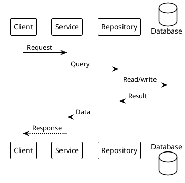

# [REQ ID] Design Delta

> This document describes incremental changes to the full design.md.

## 0. Clarification Record

### 0.1 Confirmed Design Decisions

- [Decision from delta-spec.md, user confirmation, existing design.md, or code facts]

### 0.2 Open Questions

- [ ] [Question affecting interfaces, data, compatibility, risk, or verification]

### 0.3 Decision Ledger

| Decision | Source | Status | Impact on Design or Implementation |
|----------|--------|--------|------------------------------------|
| [Key decision] | [delta-spec/user/design/code fact/agent inference] | [confirmed/needs-confirmation] | [impact] |

> Do not continue to tasks if an unconfirmed decision changes architecture, interfaces, data model, migration, compatibility, or verification strategy.

## 1. Design Context

### 1.1 Goals

[Describe the technical goals for this change.]

### 1.2 Constraints

1. [Constraint]
2. [Constraint]

### 1.3 Non-Goals

- [Explicitly excluded design work]
- [Deferred work]

## 2. Design Decisions

### 2.1 [Decision Area]

**Decision**: [State the chosen design clearly.]

**Context**: [Why this decision is needed.]

**Options**

| Option | Pros | Cons |
|--------|------|------|
| Option A (chosen) | [pros] | [cons] |
| Option B | [pros] | [cons] |

**Rationale**

- [Reason]
- [Reason]

## 3. Data Model Changes

### 3.1 Added Tables or Entities

| Name | Field | Type | Constraint | Notes |
|------|-------|------|------------|-------|
| [entity] | [field] | [type] | [constraint] | [notes] |

### 3.2 Modified Tables or Entities

| Name | Change | Compatibility Notes |
|------|--------|---------------------|
| [entity] | [change] | [notes] |

## 4. Interface Changes

### 4.1 Added Interfaces

| Interface | Request | Response | Error Handling |
|-----------|---------|----------|----------------|
| [endpoint/API/event] | [request] | [response] | [errors] |

### 4.2 Modified Interfaces

| Interface | Change | Compatibility Notes |
|-----------|--------|---------------------|
| [interface] | [change] | [notes] |

## 5. Flow Design

## 6. Risk and Mitigation

| Risk | Likelihood | Impact | Mitigation |
|------|------------|--------|------------|
| [risk] | [high/medium/low] | [high/medium/low] | [mitigation] |

## 7. Open Issues

- [ ] [Issue]

## Merge Checklist

- [ ] Data model changes are merged into design.md.
- [ ] Interface changes are merged into design.md.
- [ ] Flow changes are merged into design.md.
- [ ] Migration or rollout steps are explicit where needed.
- [ ] Diagrams render.
