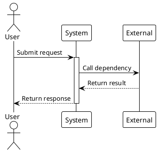

# [REQ ID] Spec Delta

> This document describes incremental changes to the full spec.md. Use ADDED, MODIFIED, and REMOVED markers.

## 0. Clarification Record

### 0.1 Confirmed Rule Decisions

- [Rule decision from proposal.md, user confirmation, or existing spec.md]

### 0.2 Open Questions

- [ ] [Question that affects business rules or acceptance criteria]

### 0.3 Decision Ledger

| Decision | Source | Status | Impact on Rules or Acceptance |
|----------|--------|--------|-------------------------------|
| [Key decision] | [proposal/user/spec/code fact/agent inference] | [confirmed/needs-confirmation] | [impact] |

> Do not continue if an unconfirmed decision changes business rules, acceptance criteria, error paths, data constraints, or out-of-scope boundaries.

## ADDED Requirements

### 5.X [Capability Name]

#### 5.X.1 Business Rules

1. **[Rule name]**: [Precise rule using must/must not/should.]
   - **Acceptance**: [trigger] -> [expected behavior]
   - **Acceptance**: [trigger] -> [expected behavior]

#### 5.X.2 Interaction Flow

#### 5.X.3 Error Scenarios

1. **Scenario: [error name]**
   - **Trigger**: [condition]
   - **System behavior**: [behavior]
   - **User-visible result**: [message, status, or error code]

## MODIFIED Requirements

### 5.Y [Existing Capability]

1. **[Rule name]**: [Full updated rule.]
   - **Previously**: [old rule]
   - **Acceptance**: [trigger] -> [new expected behavior]

## REMOVED Requirements

### 5.Z [Removed Capability]

- **Reason**: [why this is removed]
- **Migration path**: [how users adapt, if applicable]

## Data Constraint Changes

### ADDED

#### 6.X [Domain Object]

1. **[Field or invariant]**: [constraint]

### MODIFIED

#### 6.Y [Existing Domain Object]

1. **[Field or invariant]**: [new constraint]
   - **Previously**: [old constraint]

## Terminology Changes

### ADDED

**[Term]**
: [Definition.]

### MODIFIED

**[Existing term]**
: [Updated definition.]

## Merge Checklist

- [ ] ADDED requirements are merged into the right full spec section.
- [ ] MODIFIED requirements replace the old text.
- [ ] REMOVED requirements are deleted from the full spec.
- [ ] Section numbers are normalized.
- [ ] Diagrams render.
