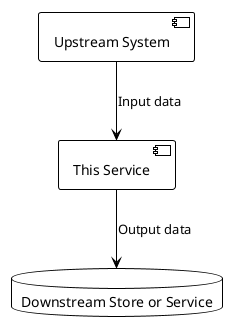

# Service Context

> This document captures external interactions for the repository. It complements spec.md and design.md; it does not replace them.

## 1. Service Purpose

- **Core responsibility**: [one sentence]
- **Deployment shape**: [service/batch job/SDK/frontend/other]
- **Owning system**: [system name]

## 2. Upstream Callers

| Caller | Scenario | Entry Point | Key Constraints |
|--------|----------|-------------|-----------------|
| [System A] | [scenario] | [API/message/job] | [auth, traffic, SLA] |

## 3. Downstream Dependencies

| Dependency | Capability | Call Type | Failure Impact | Fallback |
|------------|------------|-----------|----------------|----------|
| [Service B] | [capability] | [HTTP/RPC/message/DB] | [impact] | [strategy] |

## 4. External Platforms

| Platform | Purpose | Key Config | Ownership Boundary |
|----------|---------|------------|--------------------|
| [Platform C] | [purpose] | [config] | [owner] |

## 5. Data Flow

## 6. Operations and Environment

1. **Configuration**: [critical config and source]
2. **Metrics**: [core metrics]
3. **Alerts**: [critical alerts]
4. **Capacity**: [throughput, storage, resource limits]
5. **Release dependencies**: [release order, compatibility window, rollback requirements]

## 7. Related Documents

- Spec: `metaspec/specs/spec.md`
- Design: `metaspec/specs/design.md`
- Coding guidelines: `templates/extension/guidelines/coding.md`
- Testing guidelines: `templates/extension/guidelines/testing.md`
