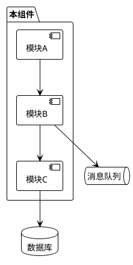
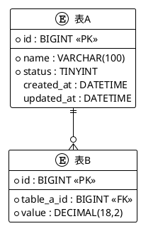
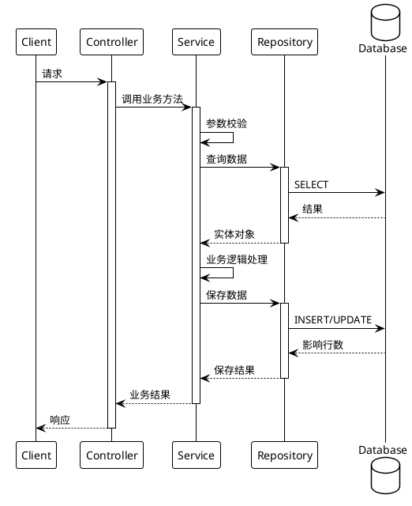

# [组件名称] 实现设计文档

## 1. 设计概述

### 1.1 设计目标

本设计文档描述[组件名称]的技术实现方案，基于 SPEC.md 中定义的功能规格进行详细设计。

### 1.2 设计约束

1. [约束1：如技术栈限制]
2. [约束2：如性能要求]
3. [约束3：如兼容性要求]

## 2. 系统架构

### 2.1 架构概览



### 2.2 模块职责

| 模块 | 职责 | 技术选型 |
|------|------|----------|
| 模块A | [职责描述] | [技术/框架] |
| 模块B | [职责描述] | [技术/框架] |
| 模块C | [职责描述] | [技术/框架] |

### 2.3 技术栈

| 类别 | 技术选型 | 版本 | 说明 |
|------|----------|------|------|
| 语言 | [如：Java] | [如：17] | |
| 框架 | [如：Spring Boot] | [如：3.x] | |
| 数据库 | [如：MySQL] | [如：8.0] | |
| 缓存 | [如：Redis] | [如：7.x] | |
| 消息队列 | [如：Kafka] | [如：3.x] | |

## 3. 数据模型

### 3.1 ER 图



### 3.2 表结构设计

#### 3.2.1 表A

| 字段 | 类型 | 约束 | 说明 |
|------|------|------|------|
| id | BIGINT | PK, AUTO_INCREMENT | 主键 |
| name | VARCHAR(100) | NOT NULL | 名称 |
| status | TINYINT | NOT NULL, DEFAULT 0 | 状态：0-待处理，1-处理中，2-已完成 |
| created_at | DATETIME | NOT NULL | 创建时间 |
| updated_at | DATETIME | NOT NULL | 更新时间 |

**索引设计**：

| 索引名 | 字段 | 类型 | 说明 |
|--------|------|------|------|
| idx_status | status | BTREE | 状态查询优化 |
| idx_created_at | created_at | BTREE | 时间范围查询优化 |

#### 3.2.2 表B

...

## 4. 接口设计

### 4.1 接口清单

| 方法 | 路径 | 说明 | 认证 |
|------|------|------|------|
| POST | /api/v1/resource | 创建资源 | 是 |
| GET | /api/v1/resource/{id} | 查询资源 | 是 |
| PUT | /api/v1/resource/{id} | 更新资源 | 是 |
| DELETE | /api/v1/resource/{id} | 删除资源 | 是 |

### 4.2 接口详设

#### 4.2.1 创建资源

**请求**：

```http
POST /api/v1/resource
Content-Type: application/json
Authorization: Bearer {token}

{
  "name": "示例名称",
  "type": "TYPE_A"
}
```

**响应**：

```json
{
  "code": 0,
  "message": "success",
  "data": {
    "id": 12345,
    "name": "示例名称",
    "type": "TYPE_A",
    "status": 0,
    "createdAt": "2024-01-01T00:00:00Z"
  }
}
```

**错误码**：

| 错误码 | HTTP状态码 | 说明 |
|--------|-----------|------|
| E4001 | 400 | 参数校验失败 |
| E4011 | 401 | 未认证 |
| E4031 | 403 | 无权限 |
| E5001 | 500 | 服务内部错误 |

## 5. 核心流程设计

### 5.1 [流程A名称]



**流程说明**：

1. [步骤1说明]
2. [步骤2说明]
3. [步骤3说明]

### 5.2 [流程B名称]

...

## 6. 算法设计

### 6.1 [算法A名称]

**算法描述**：[简述算法目的和原理]

**伪代码**：

```
function algorithmA(input):
    // 步骤1
    // 步骤2
    // 步骤3
    return result
```

**复杂度分析**：

- 时间复杂度：O(n)
- 空间复杂度：O(1)

## 7. 缓存设计

### 7.1 缓存策略

| 缓存Key | 数据内容 | 过期时间 | 更新策略 |
|---------|----------|----------|----------|
| resource:{id} | 资源详情 | 1小时 | Cache-Aside |
| list:resource | 资源列表 | 5分钟 | 写时失效 |

### 7.2 缓存一致性

[描述缓存与数据库的一致性保障方案]

## 8. 异常处理设计

### 8.1 异常分类

| 异常类型 | 处理方式 | 重试策略 |
|----------|----------|----------|
| 参数校验异常 | 直接返回错误 | 不重试 |
| 业务异常 | 返回业务错误码 | 不重试 |
| 外部服务超时 | 降级/熔断 | 指数退避重试3次 |
| 系统异常 | 记录日志，返回通用错误 | 不重试 |

### 8.2 熔断降级

[描述熔断降级策略]

## 9. 监控与日志

### 9.1 监控指标

| 指标名 | 类型 | 说明 |
|--------|------|------|
| api_request_total | Counter | API请求总数 |
| api_request_duration | Histogram | API请求耗时 |
| db_query_duration | Histogram | 数据库查询耗时 |

### 9.2 日志规范

| 日志级别 | 使用场景 |
|----------|----------|
| ERROR | 系统异常、影响业务的错误 |
| WARN | 可恢复的异常、潜在问题 |
| INFO | 关键业务流程节点 |
| DEBUG | 调试信息（生产环境关闭） |

## 10. 安全设计

### 10.1 认证方案

[描述认证实现方案]

### 10.2 授权方案

[描述授权实现方案]

### 10.3 数据安全

[描述敏感数据加密、脱敏方案]


