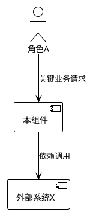
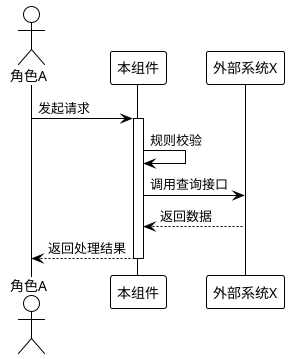

# [组件名称] 规格说明书

## 1. 组件定位

### 1.1 核心职责

本组件负责[核心业务动作]，为[上游用户/系统]提供[服务能力]，是[所属子系统]的关键组成部分。

### 1.2 核心输入

1. [来源A]：[业务实体/信号]
2. [来源B]：[业务实体/信号]

### 1.3 核心输出

1. [目标A]：[业务实体/报表]
2. [目标B]：[通知/事件]

### 1.4 职责边界（本组件不负责）

1. [明确排除的职责A]
2. [明确排除的职责B]

## 2. 领域术语

**术语名称1**
: 术语的严格业务定义。
: 备注：可选的补充说明或别名。

**术语名称2**
: 术语的严格业务定义。

## 3. 角色与边界

### 3.1 核心角色

1. **角色A**：[描述，如：发起交易的终端用户]
2. **角色B**：[描述，如：进行风控审核的运营人员]

### 3.2 外部系统

1. **系统X**：[描述，如：第三方支付网关]
2. **系统Y**：[描述，如：集团统一认证服务]

### 3.3 交互上下文

## 4. DFX 约束

### 4.1 性能

1. **响应时间**：[如：核心接口 TP99 低于 200 毫秒]
2. **吞吐量**：[如：支持 1000 QPS]
3. **资源水位**：[如：单实例堆内存占用不超过 2GB]

### 4.2 可靠性

1. **可用性**：[如：承诺 99.9% 可用性]
2. **故障恢复**：[如：依赖服务宕机时，必须降级为只读模式]
3. **数据一致性**：[如：涉及资金流转必须保证强一致性]

### 4.3 安全性

1. **认证鉴权**：[如：禁止匿名访问，必须校验 Token 有效性]
2. **数据保护**：[如：身份证号必须脱敏传输与存储]
3. **审计要求**：[如：所有写操作必须记录操作人 IP]

### 4.4 可维护性

1. **监控**：[如：必须暴露 Prometheus 指标]
2. **日志**：[如：日志必须包含 TraceID]

### 4.5 兼容性

1. **接口兼容**：[如：API 变更需兼容至少一个旧版本]
2. **数据迁移**：[如：新旧数据格式需并存过渡]

## 5. 核心能力

### 5.1 [功能模块A名称]

#### 5.1.1 业务规则

1. **规则名称**：[详细描述，例如：订单金额必须大于零]
   - **验收条件**：输入金额 -1，系统返回错误码 E4001；输入金额 0，系统返回错误码 E4001。
2. **规则名称**：[详细描述，例如：状态流转]
   - **验收条件**：当前状态为"待支付"时，接收"支付成功"事件，状态变更为"已支付"。
3. **禁止项**：[详细描述，例如：禁止删除已生效的配置]
   - **验收条件**：对状态为"生效中"的记录发起删除请求，系统拒绝并提示错误。

#### 5.1.2 交互流程

#### 5.1.3 异常场景

1. **场景：外部依赖超时**
   - **触发条件**：外部系统 X 响应时间超过 3 秒。
   - **系统行为**：自动重试 1 次；若仍失败，熔断并记录错误日志。
   - **用户感知**：收到"系统繁忙，请稍后重试"的提示。
2. **场景：并发冲突**
   - **触发条件**：两个用户同时修改同一条记录。
   - **系统行为**：采用乐观锁机制，后提交的请求失败。
   - **用户感知**：收到"数据版本已过期，请刷新后重试"的提示。

### 5.2 [功能模块B名称]

...

## 6. 数据约束

### 6.1 [领域对象A]

1. **标识符**：全局唯一，不可变更。
2. **名称**：必填，长度限制 1-100 字符，禁止包含特殊符号。
3. **类型**：枚举值，仅限于 [类型X, 类型Y, 类型Z]。

### 6.2 [领域对象B]

1. **关联**：必须关联一个有效的 [领域对象A]。
2. **有效期**：开始时间必须早于结束时间。

